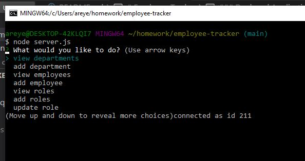
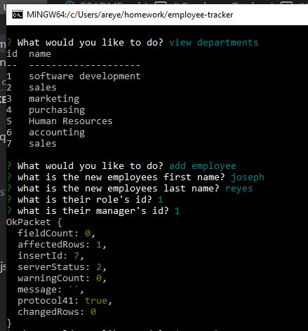

# Employee Tracker

### Deployed Application 

[Video of Employee Tracker](https://drive.google.com/file/d/1cBS8kHBCvfcbWyq_U-khE6j64lIoTCsl/view)

### Description 
This command line application allows users to view, add, and update employees.

Before creating the file, npm inquirer and console.table must be installed. Then, the user will enter 'node server.js' into the command line. This command will then prompt a series of options that can be performed. The options are to view and add departments, roles, and employees, and also to update roles. The user can continue adding, viewing, and updating until they select 'quit' on the first prompted question (this is demonstrated in the attached video).

### Features
* Uses CLI Node.js 
* JavaScript   
* Utilizes Inquirer to capture user inputs 
* Utilizes console.table to display all information in table format

### Credit
Alejandra Reyes
* areye022@gmail.com
* [GitHub](https://github.com/areye022)
* [LinkedIn](https://www.linkedin.com/in/alejandrareyes022/)

### License
Licensed under [MIT License](./LICENSE)
